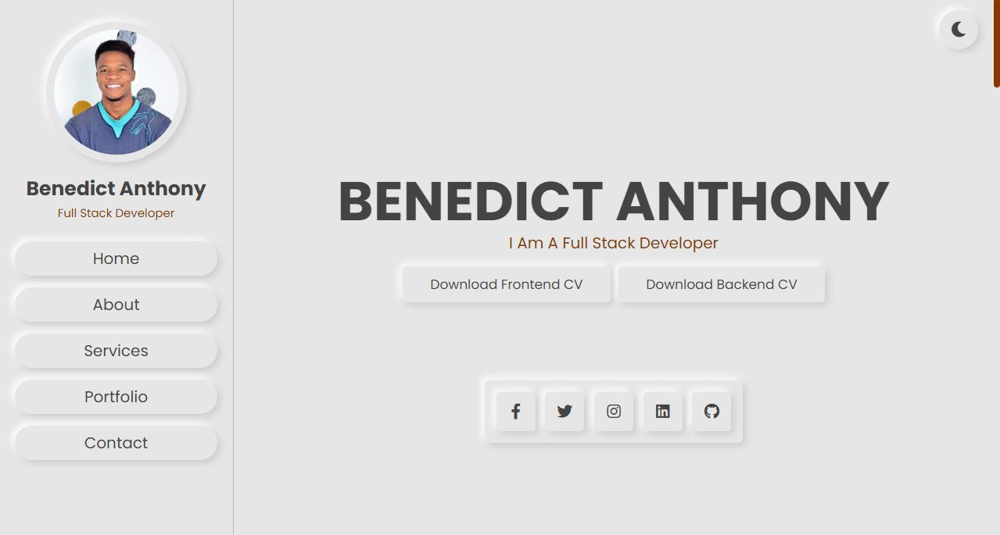

# BENEDICT ANTHONY

As a dedicated full-time full-stack developer with over 2 years of professional experience, I have gained valuable expertise in utilizing various JavaScript frameworks such as React and Next.js. These frameworks enable me to create dynamic and interactive user interfaces, ensuring an engaging and seamless user experience.

In addition to my proficiency in frontend development, I am well-versed in Redux, a state management library, which enables efficient handling of application states and ensures data consistency across components.

On the backend side, I have a strong command of Python and work extensively with the Django framework and Django REST Framework. With Django, I can rapidly develop scalable and robust backend systems, ensuring smooth data processing, authentication, and API development. The Django REST Framework allows me to create comprehensive and secure RESTful APIs, facilitating seamless communication between the frontend and backend.

My passion for delivering high-quality software extends to maintaining clean and organized code through best practices, code reviews, and automated testing. I am well-versed in version control systems like Git, which ensures collaboration and facilitates seamless deployment.

With a keen eye for detail, problem-solving skills, and a strong foundation in software development principles, I strive to deliver efficient and reliable solutions. I am always eager to learn and explore new technologies to enhance my skills and stay up-to-date with industry trends.

Overall, my experience and skills in JavaScript frameworks like React and Next.js, alongside Python and Django for backend development, enable me to create feature-rich, scalable, and user-friendly applications. I am dedicated to providing high-quality code and building innovative solutions to meet the needs of diverse projects.

